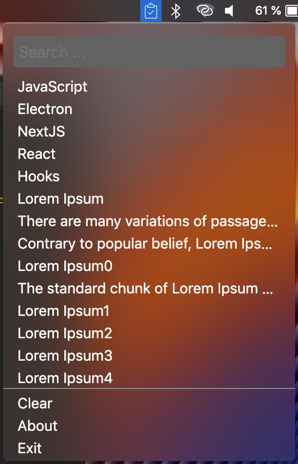
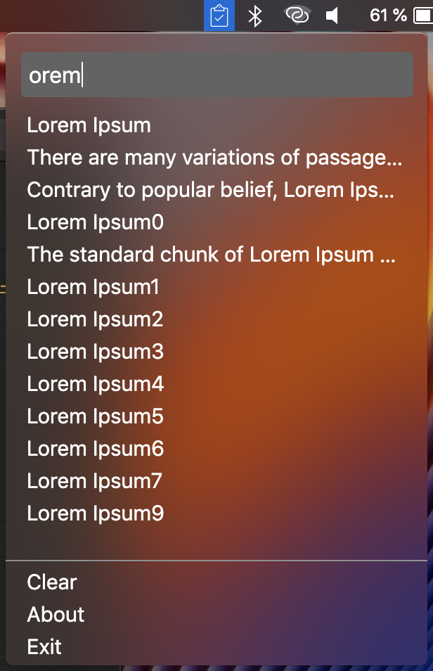

  

### Clipboard History

> Icon made by Freepik from www.flaticon.com

Clipboard History is an Electron-based application that listen to every Copy/Paste command and saves it into its local storage. It saves up to 40 texts for now.

Support:

* It has support for searching for a given text.
* Copying saved text, just click on it and voila.

Clipboard History is built using Electron + NextJS & Styled-Components

  
  

### Downloading the App

Right now this app only runs on MacOS & Windows

To download the app, go to link down below and choose your platform executable

[Download App](https://github.com/Fausto95/clipboard-history/releases/)

### TODO

- [ ] Add Keyboard Shortcuts
- [ ] Add Preferences Window
- [ ] Add Auto Launch

